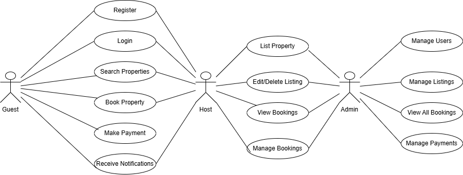

# Use Case Diagram Summary

This use case diagram provides a high-level overview of the main interactions between users and the backend system for the Airbnb Clone project. It captures the core functionalities and the roles that interact with them.

## Actors

- **Guest:** Can register, log in, search for properties, book properties, make payments, and receive notifications.
- **Host:** Can register, log in, list properties, edit or delete listings, view bookings, manage bookings, and receive notifications.
- **Admin:** Has access to manage users, manage listings, view all bookings, and manage payments.

## Key Use Cases

- **Register & Login:** Both guests and hosts can create accounts and log in to the system.
- **Search Properties:** Guests can search for available properties.
- **Book Property & Make Payment:** Guests can book properties and make payments for their bookings.
- **Receive Notifications:** Both guests and hosts receive notifications related to their activities.
- **List Property & Edit/Delete Listing:** Hosts can add new property listings and update or remove them as needed.
- **View & Manage Bookings:** Hosts can view and manage bookings for their properties.
- **Admin Functions:** Admins have the ability to manage users, listings, bookings, and payments across the platform.